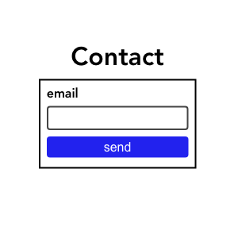

# example Playwright + MSW + Vite



## what is this?

example E2E test for front end with Playwright.

- test framework : [Playwright](https://github.com/microsoft/playwright)
- server mock : [MSW](https://github.com/mswjs/msw)
- front end build : [Vite](https://github.com/vitejs/vite)

## how to run test

```bash
git clone https://github.com/ryokryok/playwright-msw-react.git
cd playwright-msw-react
npm install
# When running tests, the development server will start at localhost:3000.
# but it may fail if localhost:3000 is already in use.
npm run test:e2e
# test with report
npm run test test:e2e:report
```

## license

MIT
